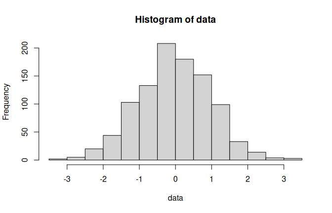
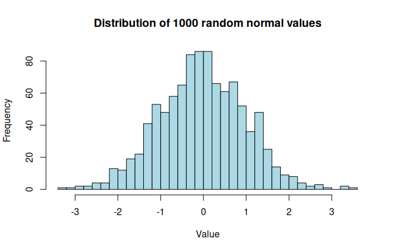
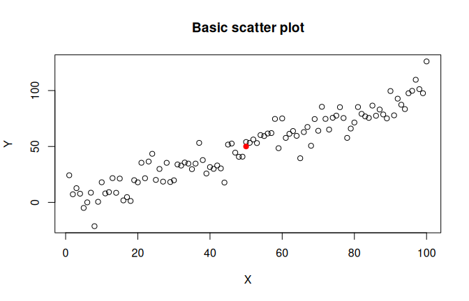
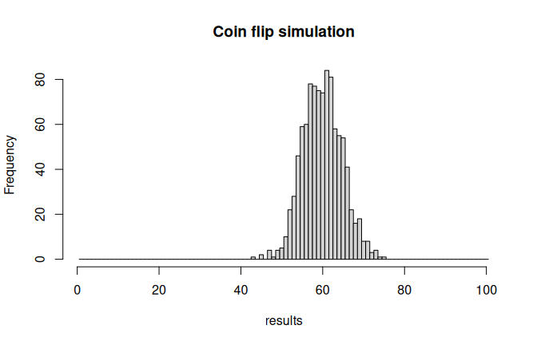

Overview of R Basic Code
================

# Overview of R basic R code

**Overview of simple R commands for generating vectors. Plot and hist.
Code for loops. The idea is for students to be able to, at least,
superficially, understand provided code in the next sessions.**

------------------------------------------------------------------------

## Vectors

The vector is the basic data structure in R for storing collections of
values. Understanding vectors is essential for working with data and
running simulations.

### Creating vectors

Combine values with `c()` (concatenate):

``` r
# Numeric vector
a_vector <- c(1, 5, 4, 9, 0)

# Character vector
my_longer_vector <- c(1, 2, 'three', '4', 'V', 6, 7, 8)

# Using the : operator for sequences
x <- 1:7
y <- 2:-2

# Using seq() for more control
step_size <- seq(1, 10, by = 0.25)
length_specified <- seq(1, 10, length.out = 20)
```

### Indexing vectors

Vector indices in R start from 1 (unlike many languages that start from
0).

``` r
# Select single element
my_single_element <- my_longer_vector[5]

# Select a range
the_start <- my_longer_vector[1:3]

# Select specific positions
my_part_of_vector <- my_longer_vector[c(1, 2, 5)]

# Overwrite elements
my_longer_vector[1:3] <- c('replace', 'this', 'now')
```

### Logical indexing

Create logical vectors for conditional selection:

``` r
vector1 <- c(1, 5, 6, 7, 2, 3, 5, 4, 6, 8, 1, 9, 0, 1)
binary_vector <- vector1 > 5
selected <- vector1[binary_vector]
```

------------------------------------------------------------------------

## Plotting: `plot()` and `hist()`

Basic visualization commands for exploring data and simulation results.

### Histograms

``` r
# Generate some data
data <- rnorm(1000)

# Basic histogram
hist(data)
```

<!-- -->

``` r
# Customize breaks and labels
hist(data, breaks = 30, main = "Distribution of 1000 random normal values",
     xlab = "Value", col = "lightblue")
```

<!-- -->

### Scatter plots

``` r
# Simple scatter plot
x <- 1:100
y <- x + rnorm(100, sd = 10)
plot(x, y, main = "Basic scatter plot", xlab = "X", ylab = "Y")

# Add points to existing plot
points(50, 50, col = "red", pch = 19)
```

<!-- -->

------------------------------------------------------------------------

## Code for loops

Loops allow you to repeat operations multiple times—essential for
simulations.

### The `for` loop

Iterates over a sequence:

``` r
# Print each value in a vector
my_vector <- runif(5)
for (x in my_vector) {
  y <- x * 3
  print(y)
}
```

    ## [1] 0.7732628
    ## [1] 2.173318
    ## [1] 0.4736587
    ## [1] 0.9463724
    ## [1] 0.8888566

``` r
# Repeat exactly n times
for (i in 1:10) {
  print("This runs 10 times")
}
```

    ## [1] "This runs 10 times"
    ## [1] "This runs 10 times"
    ## [1] "This runs 10 times"
    ## [1] "This runs 10 times"
    ## [1] "This runs 10 times"
    ## [1] "This runs 10 times"
    ## [1] "This runs 10 times"
    ## [1] "This runs 10 times"
    ## [1] "This runs 10 times"
    ## [1] "This runs 10 times"

``` r
# Common pattern: pre-allocate a vector and fill it
results <- numeric(100)
for (i in 1:100) {
  results[i] <- rnorm(1)
}
```

### The `while` loop

Repeats as long as a condition is true:

``` r
# Count up from 1 to 5
i <- 1
while (i < 6) {
  print(i)
  i <- i + 1
}
```

    ## [1] 1
    ## [1] 2
    ## [1] 3
    ## [1] 4
    ## [1] 5

``` r
# Exit early with break
counter <- 0
while (TRUE) {
  value <- rnorm(1)
  counter <- counter + 1
  if (value > 1) {
    break
  }
}
```

------------------------------------------------------------------------

## Putting it together: Simple simulation

Here’s how vectors, plotting, and loops work together in practice:

``` r
# Simulate 100 coin flips and count heads
n_flips <- 100
p_heads <- 0.6
results <- numeric(1000)  # Pre-allocate for efficiency

for (i in 1:1000) {
  flips <- sample(c(0, 1), n_flips, replace = TRUE, prob = c(1 - p_heads, p_heads))
  results[i] <- sum(flips)
}

# Visualize the distribution
hist(results, breaks = seq(0, n_flips) + 0.5, main = "Coin flip simulation")
```

<!-- -->

This combines all three Session 3 skills: vectors store the data, loops
run the simulation, and histograms visualize the results.
