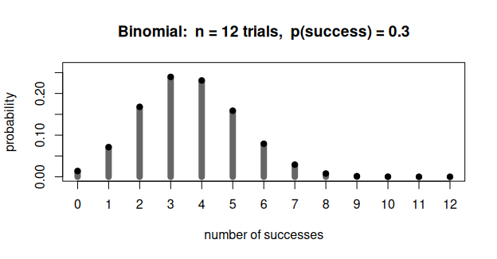
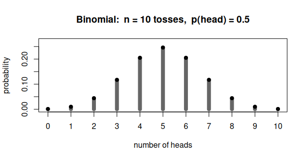
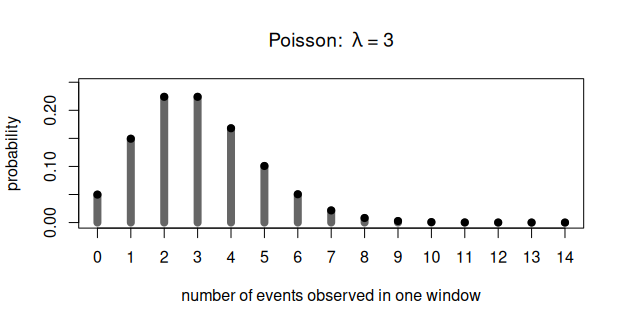
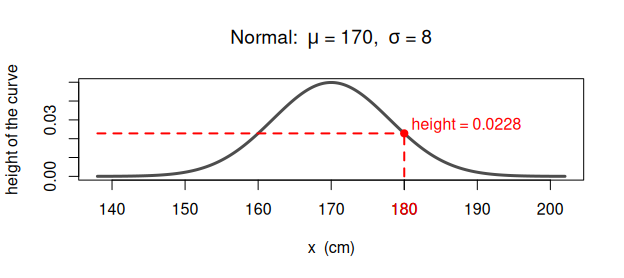
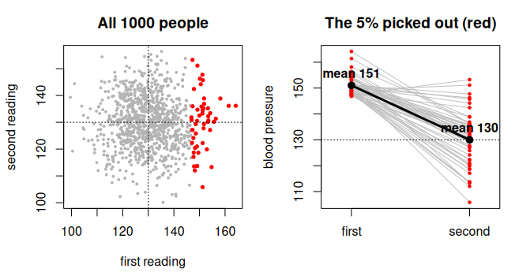

Exercise set: Simulating data
================
BIOL8001 Graduate Statistics
2026-09-01

## Question 1: reading a binomial distribution

The figure below shows a **binomial distribution with n = 12 and p =
0.3**.

<!-- -->

**(a)** In your own words, what kind of process does a binomial
distribution model? Say what its two parameters, `n` and `p`, stand for.

**(b)** Describe a concrete situation that this particular figure could
model. Say what one trial is, what counts as a success, and why `n = 12`
and `p = 0.3` for your situation.

**(c)** What is plotted on the horizontal axis, and what is plotted on
the vertical axis? Take the bar at 4 successes and explain briefly what
its height means.

**(d)** Suppose you actually run these 12 trials once, tomorrow morning.
What does this figure tell you about the result you will get? What does
it *not* tell you? Be precise about the difference between what **will**
happen on one run and what we **expect** to happen over many runs.

**(e)** The expected number of successes for this process is n × p =
3.6. But no run of 12 trials can ever produce 3.6 successes. So what
does the number 3.6 refer to, and where would you point to it on this
figure?

**(f)** The probability of 10 successes is about 0.00019. Is 10
successes impossible, or just rare? Now open `CoinRepeated.R` and set
`throws <- 12`, `p_head <- 0.3` and `repeats <- 100000`. Roughly how
many of those 100,000 runs would you expect to give 10 successes? Run it
and see whether the simulation and the red dots agree.

## Question 2: why does the distribution peak in the middle?

Now the same kind of process, but with a fair coin: **10 tosses, p(head)
= 0.5**.

<!-- -->

**(a)** Here are two statements. Both are true.

1.  With a fair coin, *every* particular sequence of 10 tosses is
    exactly as likely as every other one. HHHHHHHHHH is as likely as
    HTHTTHTHHT.
2.  The figure says that getting 5 heads is about 252 times more likely
    than getting 10 heads.

Explain, how both can be true at once. There is no contradiction, but
saying clearly why there is none is the whole point of this question.

<!-- **(b)** How many different sequences of 10 tosses contain exactly 10 heads? How many contain exactly 9 heads? How many contain exactly 5 heads? (You can reason your way to the first two; for the third, either count cleverly or look up how it is counted.) What do these three numbers tell you about the shape of the figure? -->

**(c)** The peak sits at n/2 **only because p = 0.5**. Open
`CoinRepeated.R`, set `p_head <- 0.15` and `throws <- 10`, and run it.
Where is the peak now? There are still far more sequences with 5 heads
than with 1 head, so the counting argument from (b) has not gone away.
What is the second force acting here, and why does it win?

**(d)** The last slide of the deck summarised the mechanism as *“many
ways to be average”*. Having answered (a) to (c), write one sentence
explaining what that phrase means.

## Question 3: a distribution we did not cover

We covered the binomial, the geometric and the normal in class. There
are many more (see the list of distributions linked in the slides). This
question is about one of them, the **Poisson distribution**, which you
should look up yourself.

**(a)** What kind of process does the Poisson distribution model? What
is its parameter, usually written λ (lambda), and what does that
parameter stand for?

**(b)** Every distribution comes with assumptions, and when the
assumptions fail the distribution no longer describes the process (this
was the point of `CoinAssumptions.R`). What does the Poisson
distribution assume about the events being counted? Describe one
situation in which you would be counting events but the Poisson would be
the wrong model, and say which assumption breaks.

**(c)** Give an example of a Poisson-like process from your own field or
your own research. State clearly: what counts as one **event**, over
what **window** (of time, area, volume…) you are counting, and what λ
would mean for your example.

**(d)** The figure below is a Poisson distribution with λ = 3. Describe
what it shows: what is on each axis, and what does the height of the bar
at 2 mean? Why is there nothing plotted between 2 and 3? Is there a
largest possible value on the right-hand side? Compare your answer to
the geometric distribution in `Nesting.R`, and say whether the two
behave the same way in the right tail.

<!-- -->

<!-- **(e)** Both the binomial and the Poisson give you a distribution over counts. In one or two sentences: what is the difference in the *process* each one describes? (Hint: in the binomial, what fixes the largest count you could possibly observe? Does the Poisson have anything playing that role?) -->

## Question 4: reading a normal distribution

The figure shows a normal distribution with mean μ = 170 and standard
deviation σ = 8 (think of adult height in cm). The dashed line marks x =
180, and the curve there has a height of about 0.0228.

<!-- -->

**(a)** Is 0.0228 the probability of observing a value of 180? What is
the probability of observing *exactly* 180 (that is, 180.000000…)?
Explain your answer.

**(b)** If the height of the curve is not a probability, what is it? And
what do you have to do with the curve to get an actual probability out
of it? Give an example of a question about this distribution that *does*
have a non-zero answer.

**(c)** In Questions 1 and 2 the heights of the bars *were*
probabilities, and they added up to 1. Here they are not. What is the
difference between those distributions and this one that causes this?

<!-- **(d)** Below is the same shape used for a different measurement: a bone measured with a caliper, μ = 25 mm and σ = 0.2 mm. The curve now reaches a height of nearly 1.99. A probability can never be greater than 1. So what is that number? (Hint: the vertical axis has units. What would happen to the peak height if we recorded the same measurements in centimetres instead of millimetres?) -->

<!-- ```{r q4-narrow, fig.width=6.5, fig.height=2.5} -->

<!-- mu2 <- 25; sd2 <- 0.2 -->

<!-- curve(dnorm(x, mu2, sd2), from = mu2 - 4 * sd2, to = mu2 + 4 * sd2, n = 500, -->

<!--       lwd = 3, col = "grey30", xlab = "x  (mm)", ylab = "height of the curve", -->

<!--       main = expression(paste("Normal:  ", mu, " = 25 mm,  ", sigma, " = 0.2 mm"))) -->

<!-- abline(h = dnorm(mu2, mu2, sd2), lty = 3, col = "red") -->

<!-- text(mu2 - 4 * sd2, dnorm(mu2, mu2, sd2) * 0.80, -->

<!--      paste("peak height =", round(dnorm(mu2, mu2, sd2), 2)), col = "red", adj = 0) -->

<!-- ``` -->

**(e)** In practice nobody ever records a height of exactly 180 cm: a
measuring device that reads to the nearest centimetre reports “180” for
anything between 179.5 and 180.5. Is the probability of *that* zero?
Does this rescue the question asked in (a), and if so, what does it tell
you about what a measured value really is?

## Question 5: what happens after an extreme value

This last question goes a beyond what we did in class.

Consider a quantity that varies randomly around a fixed mean according
to a normal distribution: blood pressure measured on a given morning,
say. To keep things as simple as possible, assume the 1000 people in
this simulation are **identical** in their true blood pressure (130),
and that all the variation between the numbers we record comes from the
measurement and from day-to-day fluctuation. Nobody is treated, and
nothing at all is done between the two occasions. Each person is
measured twice.

**(a)** Answer this part *before* you look at the figure. We take the 5%
of people with the **highest** first reading, and we measure exactly
those people again. On average, will their second readings be higher
than their first, about the same, or lower? Say why you think so.

<!-- -->

The 50 people picked out on their first reading averaged 151. Measured a
second time, with nothing done to them, the same people averaged 130.
The dotted line is the true value, 130, which was the same for everybody
the whole time.

**(b)** Explain the mechanism. Nothing was done to these people, and the
process that generates the numbers did not change between the two
occasions. So why did the group become less extreme?

**(c)** Does the process “remember” the extreme first reading and
compensate for it on the second occasion — is there any force pulling
the value back towards 130? Answer carefully, and say what it is about
the way the second reading is generated that makes you answer as you do.

**(d)** In this simulation everyone had the same true blood pressure of
130, so every difference between the numbers recorded was chance. Real
people are not identical. Redo the reasoning you gave in (b) for a
population in which people genuinely differ from one another. Would the
group you picked out still fall back on the second occasion? Would it
fall all the way to 130? Say what has changed and what has not.

**(e)** Following from (d): what decides *how far* the group falls back?
Describe a case where it would fall all the way back, and a case where
it would not fall at all, and say what is different between them.

**(f)** Flight instructors noticed that when a trainee was praised for
an exceptionally good landing, the next landing was usually worse, and
when a trainee was criticised for a bad one, the next was usually
better. They concluded that criticism works and praise backfires. Could
this pattern appear even if praise and criticism had no effect
whatsoever on landings? What would you have to observe to tell the two
explanations apart?
