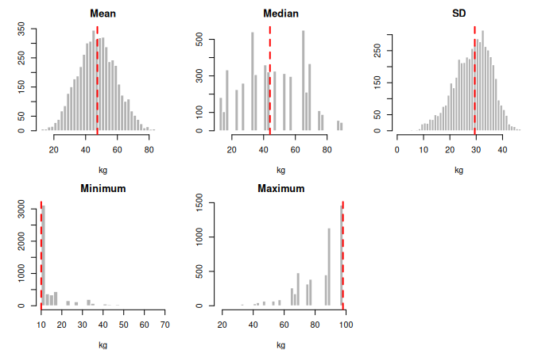

Exercise set: Sampling distributions
================
BIOL8001 Graduate Statistics
2026-09-16

## Question 1: the width of the sampling distribution

The standard deviation of the sampling distribution of the mean is

$$\sigma_{\bar{x}} = \frac{\sigma}{\sqrt{n}}$$

which is smaller than the spread of the population itself for any sample
bigger than one. The figure plots it against `n` for a colony with
$\sigma = 12$ kg.

<!-- -->

**(a)** Take a colony with μ = 80 kg and σ = 12 kg, the σ used in the
figure. A single penguin weighing 90 kg is nothing unusual there, since
it is less than one σ above the mean. Now think about what has to happen
for a sample of five penguins from this colony to average 90 kg. Use the
comparison to explain why the sampling distribution is narrower than the
population. Do not quote the formula back.

**(b)** The curve drops steeply and then flattens. Using the figure or
the formula: how many penguins do you need to halve the width you get at
`n = 10`? And to halve it again? What does that pattern mean for someone
deciding how much fieldwork to do?

**(c)** Fill in the last two columns. Each row is a different variable
in a different population.

| Variable | population mean μ | population sd σ | sample size n | mean of the sampling distribution | sd of the sampling distribution |
|----|----|----|----|----|----|
| Flipper length (mm) | 190 | 8 | 16 |  |  |
| Egg mass (g) | 95 | 12 | 9 |  |  |
| Dive depth (m) | 40 | 15 | 25 |  |  |
| Birds per colony | 500 | 100 | 4 |  |  |

**(d)** You filled in the table without being told what you were allowed
to assume. List what has to be true for your two columns to be correct.
Think about how the sample was taken, where the value of σ came from,
and the shape of the population. Then consider each of these in turn:

1.  The σ in the table was never known. Someone estimated it from the
    sample. Which of your entries can you still stand behind, and which
    not?
2.  Dive depth (row 3) and birds per colony (row 4) both turn out to be
    strongly skewed. Do the numbers in your last two columns change?
    What does change is how well a normal curve describes the sampling
    distribution. For which of the two rows would you worry more, and
    why?

## Question 2: four colonies that agree on μ and on σ

The top row shows four colonies of 2000 penguins each. All four have a
mean of exactly 50 kg and a standard deviation of exactly 12 kg. The
second and third rows show what the sampling distribution of the mean
looks like for each colony, for two sample sizes. The second and third
rows share one horizontal axis so that their widths can be compared; the
top row has its own. The figure is made the same way as
`SameMeanSameSD.R`.

<!-- -->

**(a)** The four colonies agree on both numbers we normally use to
summarise a population. What has the summary thrown away? Using the top
row, describe for one colony of your choice something a biologist would
want to know that μ and σ do not tell them.

**(b)** Colony C has a mean of 50 kg, and almost no penguin in it weighs
anything close to 50 kg. Its sampling distribution of the mean is
nevertheless centred on 50. Is the sampling distribution then centred on
a lie? Say what the number 50 is a correct statement about, and what it
is not.

**(c)** We have made two separate claims about the sampling distribution
of the mean: (1) its standard deviation is σ/√n, as in Question 1, and
(2) its shape is approximately normal. Compare the four panels in the
middle row with each other, then compare the middle row with the bottom
row. For each claim, say whether it holds for all four colonies at both
sample sizes. One of the two claims does not always hold. Name the panel
where it fails most clearly, and explain why that panel looks the way it
does.

**(d)** A colleague says: “My measurements are clearly not normally
distributed, so none of this applies to my data.” Which distribution
does the normality claim in (c) refer to — the population, the one
sample they collected, or the sampling distribution? Answer using the
figure, and say what you would tell the colleague.

## Question 3: the mean is not the only statistic

A statistic is any number you calculate from a sample, so the mean has
no special claim here. The figure takes samples of five from the 31
penguins in `PenguinMean.R` and calculates five different statistics on
every sample. Each panel is the sampling distribution of one of them.
The dashed line marks the value of that same statistic calculated on all
31 penguins — the truth we are usually trying to recover. See
`PenguinStatistics.R`.

<!-- -->

**(a)** Go panel by panel and say how each sampling distribution sits
relative to its dashed line: centred on it, or consistently to one side
of it, and by how much compared with the width of the panel.

**(b)** Two of the five panels sit on one side of their dashed line in a
way that could have been predicted before any simulation was run. Which
two, and why does it have to come out that way? For each of the two,
could a sample of five ever produce a value on the other side of the
line?

**(c)** The mean and the median are both answers to the question “where
is the middle of this colony?” Compare their two panels. If both are
roughly in the right place, what exactly would you be giving up by
reporting the median instead of the mean?

**(d)** True or false: the median has a sampling distribution. Is there
any statistic you could calculate from a sample that does not have one?
Justify your answer using the definition of a statistic, not by listing
examples.

**(e)** Only one of these five panels has the tidy formula from Question
1 attached to it. What would you have to do to get the other four?
(`PenguinStatistics.R` is doing exactly that — say what it is doing in a
sentence.)

**(f)** Suppose you had to report the heaviest penguin in a colony, and
you could only catch five. Knowing what the maximum panel looks like,
what would you tell a reader about your reported number? Would catching
20 remove the problem, or only shrink it?

## Question 4: when σ is unknown

Everything so far assumed we knew the population standard deviation σ.
We almost never do. The first figure shows the t distribution for a
sample of five penguins (`df` = 4), with a standard normal drawn on top
of it for comparison. Both are on the t axis, which counts standard
errors rather than kilograms. See `TCurve.R`.

<!-- -->

The second figure is that same t curve carrying a kilogram ruler as
well, for a sample of five penguins with an observed sd of 12 kg and an
assumed mean of 50 kg. See `TAxisInKilograms.R`.

<!-- -->

**(a)** In your own words, what problem does the t distribution solve?
Your answer should name the piece of information we lost and say what we
put in its place.

**(b)** Compare the two curves in the first figure. Where do they
differ, and where do they agree? Given your answer to (a), why does that
particular difference make sense as the price of the substitution?

**(c)** For a normal distribution, 95% of the curve lies within about
1.96 standard errors of the centre. Find the corresponding number for
the t with `df` = 4 (use `TCurve.R`, R, or a table). Then use the second
figure to say what the difference between those two numbers is worth
**in kilograms** for this sample. Would you have called that difference
negligible before computing it?

**(d)** Student’s theorem requires a normally distributed population but
works at any sample size; the CLT needs a large sample but works for any
population shape. You have caught five penguins from a colony whose
shape you have never seen. Which of the two are you leaning on, and what
exactly are you assuming when you do? Look back at Colony C in Question
2 before answering.

**(e)** Run `TCurve.R` with `n <- 5` and then with `n <- 30`, and
compare the two curves. What happens, and why does the distinction
between the t and the normal stop mattering as the sample grows? Connect
this to what the sample sd is doing as `n` increases.

## Question 5 (beyond class): from a sampling distribution to a confidence interval

We did not cover this in class. Everything you need is in the questions
above, and this question walks you through it.

A researcher catches five penguins from the colony in `PenguinMean.R`.
Their weights are 89, 78, 65, 44 and 34 kg, so the sample mean is 62 kg
and the sample sd is about 22.9 kg. The researcher writes: “the mean
weight of this colony is 62 kg.”

**(a)** What is wrong with that sentence? Of the three kinds of
distribution we have met (the population, the one sample, the sampling
distribution), which one would you need in order to say how far 62 kg
might be from the colony’s true mean? Which of the three is the
researcher actually holding?

**(b)** Question 4(c) gave the t value that leaves 95% of the `df` = 4
curve in the middle. So in 95% of samples of five, the sample mean lands
within that many standard errors of μ. Now turn this around. If
$\bar{x}$ is within that distance of μ, then μ is within the same
distance of $\bar{x}$. Explain in your own words why this reversal is
allowed. It lets us build an interval around the one number we actually
have:

$$\bar{x} \pm t_{0.975,\,n-1} \cdot \frac{s}{\sqrt{n}}$$

**(c)** Work out this 95% confidence interval for the researcher’s five
penguins. Then rewrite the researcher’s sentence so that it is
defensible.

**(d)** The figure below repeats the researcher’s study 50 times. Each
time it draws five penguins from the same colony and builds the interval
from (c). The dashed line is the true mean of all 31 penguins, which a
real researcher would never get to see. Intervals that miss it are drawn
in red.

<!-- -->

3 of the 50 intervals miss the true mean. The true mean stays put in
every repeat. What changes from one repeat to the next? So what exactly
is the “95%” a property of? Is it a property of any single interval in
the figure?

**(e)** Say whether each of these readings of the researcher’s interval
is defensible, and explain what is wrong with the ones that are not.
Compare them with the readings of the p-value in Question 6(b).

1.  There is a 95% probability that the colony’s mean lies inside this
    interval.
2.  95% of the penguins in the colony weigh something inside this
    interval.
3.  If many researchers each caught five penguins and built an interval
    this way, about 95% of their intervals would contain the colony’s
    mean.
4.  If the researcher caught five new penguins, there is a 95% chance
    their mean would fall inside this interval.

**(f)** The interval rests on the t distribution, which assumes a normal
population. The 31 penguins are clearly not normal (look at their
histogram in `PenguinMean.R`). Yet close to 95% of intervals still
capture the true mean when you run the simulation for many more repeats.
Use your answer to Question 4(d) to say why you should not count on this
for every population. Which colony from Question 2 would you most worry
about? Several intervals in the figure also reach below 0 kg. What does
that tell you about the assumption the interval rests on?

**(g)** The researcher goes back and catches 20 penguins, and the sample
sd comes out about the same. Roughly how much narrower will the interval
be? Two things make it narrower. Name both, and use Question 1(b) to say
which of them does most of the work.

## Question 6: using a sampling distribution to say something about the world

This is the calculation from the end of the slides. We assume a
population of penguins with μ = 5 kg and σ = 3 kg. We catch 15 of them
and the mean weight of our sample is 6.15 kg. The figure shows the
sampling distribution that follows from the assumption, with the
observed mean marked.

<!-- -->

The shaded area is 0.06882.

**(a)** Write one sentence that says exactly what that number is the
probability of. Your sentence must make clear what is being assumed and
what is being observed, and it should be possible to tell from it that
the number is not a statement about a single penguin.

**(b)** Here are four readings of the same number. Decide for each
whether it is defensible, and say what is wrong with the ones that are
not.

1.  There is a 6.9% chance that the population mean is 5 kg.
2.  There is a 6.9% chance that our result is due to chance.
3.  If μ really were 5 kg and σ really were 3 kg, and many research
    groups each weighed 15 penguins, about 7% of them would report a
    mean of 6.15 kg or more.
4.  The probability of getting a sample mean of exactly 6.15 kg is 6.9%.

**(c)** The question asked was about a mean of “6.15 kg **or larger**”.
Why is it phrased that way rather than asking about 6.15 kg itself?
(Question 4 of the previous exercise set is the relevant one here.)

**(d)** Keeping the same 15 penguins and the same observed mean of 6.15
kg, the slides redo the calculation assuming μ = 3 instead, and gets
0.00002. Nothing about the penguins changed between the two
calculations. So what is the p-value a property of? Name every
ingredient it depends on.

**(e)** Suppose the same mean of 6.15 kg had come from 60 penguins
instead of 15, with μ = 5 and σ = 3 as before. Work out the new
probability (`NormalCurve.R` will draw it, or use R directly). What
changed, and what did not? What does this suggest about reporting a
p-value without the sample size next to it?

**(f)** The slides stop here with the words “now what?” and takes no
decision. What further ingredient would you need to turn 0.06882 into a
decision about the assumed population? Is that ingredient anywhere in
the data, and if not, where does it come from?

## Question 7 (harder): a statistic built from two samples

This one goes beyond what we did in class, and it is the one to attempt
last.

A questionnaire asks whether animal research is wrong, answered on a
7-point scale. Assume that in the population the mean for women is 5,
the mean for men is 4, and the standard deviation in both groups is
1.55. Twelve women and twelve men are selected at random, and we record
the difference between the two sample means.

**(a)** That difference is a statistic, calculated from a sample, so it
has a sampling distribution like everything else in this sheet. Before
calculating anything: where would that distribution be centred, and
would you expect it to be wider or narrower than the sampling
distribution of either group’s mean on its own? Say why.

**(b)** What is the probability that the women’s sample mean comes out
more than 1.5 points above the men’s? You will need the sd of the
sampling distribution of the difference; look up how the two groups’
standard errors combine, and say in one line why they combine that way
rather than simply adding.

**(c)** Check your answer by simulation. Adapt the loop in
`PenguinMean.R`: on each repeat, draw 12 women and 12 men from normal
populations with the parameters above, record the difference in means,
and repeat a few thousand times. How close is the simulation to your
calculation, and what would make it closer?

**(d)** Suppose a study of this size reports a difference of 1.5 points
and concludes that women and men differ. Using the distribution you just
built, comment on how much a single study of 12 and 12 tells you about
the size of the difference in the population.
