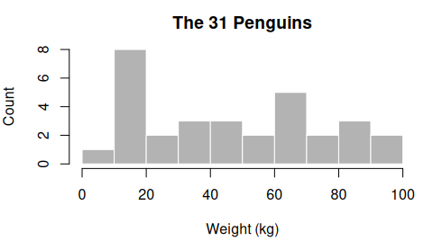

Exercise set: Sampling distributions
================
BIOL8001 Graduate Statistics
2026-09-16

For the calculations in this sheet you can use R, the scripts from
class, or two online calculators: one for the [normal
distribution](https://mabognar.github.io/apps/normal.html) and one for
the [t distribution](https://mabognar.github.io/apps/t.html).

## Question 1: The width of the sampling distribution

As we have seen, the standard deviation of the sampling distribution of
the mean is

$$\sigma_{\bar{x}} = \frac{\sigma}{\sqrt{n}}$$

which is smaller than the spread of the population itself for any sample
size bigger than one. The left panel shows a colony with μ = 80 kg and σ
= 12 kg. The right panel plots the sd of the sampling distribution
against `n` for that colony.

<!-- -->

**(a)** Take the colony in the left panel. A single penguin weighing 90
kg is nothing unusual there, since it is less than one σ above the mean.
Now think about what has to happen for a sample of five penguins from
this colony to average 90 kg. Use the comparison to explain why the
sampling distribution is narrower than the population. Do not quote the
formula back.

**(b)** The curve drops steeply and then flattens. Using the figure or
the formula: how many penguins do you need to halve the width you get at
`n = 10`? And to halve it again?

**(c)** Each row below is a different variable in a different
population. The first four columns describe the population. The last
three describe the sampling distribution of the mean for samples of size
`n`.

| Variable | population mean μ | population sd σ | population shape | sample size n | mean of the sampling distribution | sd of the sampling distribution | shape of the sampling distribution |
|----|----|----|----|----|----|----|----|
| Flipper length (mm) | 190 | 8 | normal | 16 |  |  |  |
| Egg mass (g) | 95 | 12 | normal | 9 |  |  |  |
| Dive depth (m) | 40 | 15 | strongly skewed | 25 |  |  |  |
| Birds per colony | 500 | 100 | strongly skewed | 4 |  |  |  |

Fill in the last three cells. Mark each entry as exact, approximate, or
unknown, and give your reason for any entry that is not exact.

**(d)** For row 4, you want the probability that a sample of four
colonies averages more than 600 birds. Can you get it from a normal
curve (R or the normal calculator) with the mean and sd in your table?
Could you answer the same kind of question for row 3 that way, say the
probability that the mean dive depth exceeds 45 m?

## Question 2: Four colonies that agree on μ and on σ

The top row shows four colonies of 2000 penguins each. All four have a
mean of exactly 50 kg and a standard deviation of exactly 12 kg. The
second and third rows show the sampling distribution of the mean for
each colony at two sample sizes. The figure is made the same way as
`SameMeanSameSD.R`.

<!-- -->

**(a)** The four colonies agree on both numbers we normally use to
summarise a population. What has the summary thrown away? Using the top
row, describe for one colony of your choice something a biologist would
want to know that μ and σ do not tell them. How does this relate to
Stephen J Gould’s essay [The Median Isn’t the
Message](https://journalofethics.ama-assn.org/article/median-isnt-message/2013-01)?

**(b)** Colony C has a mean of 50 kg, and almost no penguin in it weighs
anything close to 50 kg. Its sampling distribution of the mean is
nevertheless centred on 50. Is the sampling distribution then centred on
a lie? Say what the number 50 is a correct statement about, and what it
is not.

**(c)** Here are two separate statements about the sampling distribution
of the mean: (1) its mean is μ and its standard deviation is σ/√n, as in
Question 1, and (2) its shape is approximately normal, which is what the
central limit theorem says for large samples. Compare the four panels in
the middle row with each other, then compare the middle row with the
bottom row. For each claim, say whether it holds for all four colonies
at both sample sizes. One of the two claims does not always hold. Name
the panel where it fails most clearly, and explain why that panel looks
the way it does.

**(d)** A colleague says: “My measurements are clearly not normally
distributed, so none of this applies to my data.” Which distribution
does the normality claim in (c) refer to: the population, the one sample
they collected, or the sampling distribution? Answer using the figure,
and say what you would tell the colleague.

## Question 3: The mean is not the only statistic

A statistic is any number you calculate from a sample, so the mean is
not special. The figure takes samples of five from the 31 penguins in
`PenguinMean.R` and calculates five different statistics on every
sample. Each panel is the sampling distribution of one of them. The
dashed line marks the value of that same statistic calculated on all 31
penguins, i.e., the truth we are usually trying to infer. See
`PenguinStatistics.R`.

<!-- -->

\[comment: Let’s retthing this whole quesiton\]

**(a)** Go panel by panel and say how each sampling distribution sits
relative to its dashed line: centred on it, or consistently to one side
of it, and by how much compared with the width of the panel.

**(b)** Two of the five panels sit on one side of their dashed line in a
way that could have been predicted before any simulation was run. Which
two, and why does it have to come out that way? For each of the two,
could a sample of five ever produce a value on the other side of the
line?

**(c)** The mean and the median are both answers to the question “where
is the middle of this colony?” Compare their two panels. If both are
roughly in the right place, what exactly would you be giving up by
reporting the median instead of the mean?

**(d)** True or false: the median has a sampling distribution. Is there
any statistic you could calculate from a sample that does not have one?
Justify your answer using the definition of a statistic, not by listing
examples.

**(e)** Only one of these five panels has the tidy formula from Question
1 attached to it. What would you have to do to get the other four?
(`PenguinStatistics.R` does exactly that. Say in one sentence what it is
doing.)

**(f)** Suppose you had to report the heaviest penguin in a colony, and
you could only catch five. Knowing what the maximum panel looks like,
what would you tell a reader about your reported number? Would catching
20 remove the problem, or only shrink it?

## Question 4: When σ is unknown

Everything so far assumed we knew the population standard deviation σ.
We almost never do. The first figure shows the t distribution: the
sampling distribution of

$$t = \frac{\bar{x} - \mu}{s/\sqrt{n}}$$

for samples of five penguins (`df` = 4), with a standard normal drawn on
top of it for comparison. Both are on the t axis, which counts standard
errors rather than kilograms. See `TCurve.R`.

<!-- -->

The second figure shows the same t-curve with a kilogram ruler, for a
sample of five penguins with an observed sd of 12 kg and an assumed mean
of 50 kg. See `TAxisInKilograms.R`.

<!-- -->

**(a)** In your own words, what problem does the t distribution solve?
Your answer should name the piece of information we lost and say what we
put in its place.

**(b)** Compare the two curves in the first figure. Where do they agree,
and where do they differ? For a normal population, $\bar{x}$ has an
exactly normal sampling distribution. Why doesn’t t? The t statistic
uses the sample sd instead of σ, and the sample sd changes from sample
to sample. Use that to explain why the t curve differs from the normal
in the way it does. (Hint: what happens to t when a sample happens to
give a sample sd much smaller than σ?)

**(c)** The hint in (b) points at samples whose sd comes out smaller
than σ. How often does that happen?

1.  Before calculating anything, guess: if you draw many samples of five
    from a normal population with σ = 12 kg, what fraction of them will
    have a sample sd below 12 kg?
2.  Check your guess by simulation. Draw 10,000 samples of five with
    `rnorm(5, 50, 12)`, calculate the `sd()` of each, and count how
    often it is below 12. Also calculate the average of the 10,000 sds,
    and the average of their squares (the variances).
3.  Compare the average sd with σ = 12, and the average variance with σ²
    = 144. Explain how both results can be true at once. (Hint: how far
    below σ can a sample sd go, and how far above it?)
4.  Repeat with samples of 2 and of 30. How does the fraction below σ
    change, and what does that suggest about which samples fill the
    tails of the t curve when `n` is small?

**(d)** For a normal distribution, 95% of the curve lies within about
1.96 standard errors of the centre. Find the corresponding number for
the t with `df` = 4 (use `TCurve.R`, R, the t calculator, or a table).
Then use the second figure to say what the difference between those two
numbers is worth **in kilograms** for this sample. Would you have called
that difference negligible before computing it?

**(e)** Run `TCurve.R` with `n <- 5` and then with `n <- 30`, and
compare the two curves. What happens, and why does the distinction
between the t and the normal stop mattering as the sample grows? Connect
this to what the sample sd is doing as `n` increases.

## Question 5: From a sampling distribution to a confidence interval

We did not cover this in class, but the questions contain sufficient
information to solve them.

A researcher catches five penguins from the colony in `PenguinMean.R`.
Their weights are 89, 78, 65, 44, and 34 kg, so the sample mean is 62
kg, and the sample sd is about 22.9 kg. The researcher writes: “The mean
weight of this colony is 62 kg.”

**(a)** What is wrong with that sentence? Think about what a second
researcher would report after catching five different penguins. Of the
three kinds of distribution we have met (the population, the one sample,
the sampling distribution), which one tells you how far a sample mean
typically lands from the colony’s true mean? The researcher only has one
sample. What can they calculate from it to estimate the width of that
distribution?

**(b)** Question 4(d) gave the t value that leaves 95% of the `df` = 4
curve in the middle. So in 95% of samples of five, the sample mean lands
within that many estimated standard errors of μ, where the standard
error $s/\sqrt{n}$ is calculated from that same sample. Now turn this
around. If $\bar{x}$ is within that distance of μ, then μ is within the
same distance of $\bar{x}$. This lets us build an interval around the
one number we actually have:

$$\bar{x} \pm t_{0.975,\,n-1} \cdot \frac{s}{\sqrt{n}}$$

In the sentence “in 95% of samples, μ lies within this distance of
$\bar{x}$”, which quantities change from sample to sample, and which
stays fixed?

**(c)** Work out this 95% confidence interval for the researcher’s five
penguins. Then rewrite the researcher’s sentence so that it is
defensible.

**(d)** The figure below repeats the researcher’s study 50 times. Each
time it draws five penguins from the same colony and builds the interval
from (c). The dashed line is the true mean of all 31 penguins, which a
real researcher would never get to see. Intervals that miss it are drawn
in red.

<!-- -->

3 of the 50 intervals miss the true mean. The true mean stays put in
every repeat. What changes from one repeat to the next? So what exactly
is the “95%” a property of? Is it a property of any single interval in
the figure?

**(e)** Say whether each of these readings of the researcher’s interval
is defensible, and explain what is wrong with the ones that are not.
Compare them with the p-values in Question 6(b).

1.  There is a 95% probability that the colony’s mean lies inside this
    interval.
2.  95% of the penguins in the colony weigh something inside this
    interval.
3.  If many researchers each caught five penguins and built an interval
    this way, about 95% of their intervals would contain the colony’s
    mean.
4.  If the researcher caught five new penguins, there is a 95% chance
    their mean would fall inside this interval.

**(f)** The t interval is exact only when the population is normal. The
histogram below shows the 31 penguins, which are clearly not normal.

<!-- -->

With five penguins per sample, the central limit theorem cannot do much
to rescue the interval either. How well the interval works then depends
on the shape of the population. For samples of five, the interval
captures the true mean about 95% of the time for Colony A in Question 2,
but only about 93% of the time for the skewed Colony D, and less still
for more strongly skewed populations. What would you want to know about
a colony before trusting a 95% interval built from five penguins?
Several intervals in the figure above also reach below 0 kg. What does
that tell you about the assumption the interval rests on?

**(g)** The researcher goes back and catches 20 penguins, and the sample
sd comes out about the same. Roughly how much narrower will the interval
be? Two things make it narrower. Name both, and use Question 1(b) to say
which of them does most of the work. What does this mean for someone
deciding how many penguins to catch?

## Question 6: Using a sampling distribution for inference

This is the calculation from the end of the slides. We assume a
population of penguins with μ = 5 kg and σ = 3 kg. We catch 15 of them,
and the sample mean is 6.15 kg. The figure shows the sampling
distribution under this assumption, with the observed mean marked.

<!-- -->

The shaded area is 0.06882.

**(a)** Write one sentence that says exactly what that number is the
probability of. Your sentence must make clear what is being assumed and
what is being observed, and it should be possible to tell from it that
the number is not a statement about a single penguin.

**(b)** Here are four readings of the same number. Decide for each
whether it is defensible, and say what is wrong with the ones that are
not.

1.  There is a 6.9% chance that the population mean is 5 kg.
2.  There is a 6.9% chance that the difference between 6.15 kg and 5 kg
    is just sampling variation.
3.  If μ really were 5 kg and σ really were 3 kg, and many research
    groups each weighed 15 penguins, about 7% of them would report a
    mean of 6.15 kg or more.
4.  The probability of getting a sample mean of exactly 6.15 kg is 6.9%.

**(c)** The question asked was about a mean of “6.15 kg **or larger**”.
Why is it phrased that way rather than asking about 6.15 kg itself?
(Question 4 of the previous exercise set is the relevant one here.)

**(d)** Keeping the same 15 penguins and the same observed mean of 6.15
kg, the slides redo the calculation assuming μ = 3 instead, and get
0.00002. Nothing about the penguins changed between the two
calculations. So what is the p-value a property of? Name every
ingredient it depends on.

**(e)** Suppose the same mean of 6.15 kg had come from 60 penguins
instead of 15, with μ = 5 and σ = 3 as before. Work out the new
probability (`NormalCurve.R` will draw it, or use R or the normal
calculator). What changed, and what did not? What does this suggest
about reporting a p-value without the sample size next to it?

**(f)** The slides stop here with the words “now what?” and take no
decision. To turn 0.06882 into a decision about the assumed population
(keep μ = 5 kg or reject it), you need a cut-off. What is that cut-off
usually called, and what does it stand for? Is it anywhere in the data,
and if not, where does it come from?

## Question 7: A statistic built from two samples

This question goes beyond what we did in class, and it is the one to
attempt last.

A questionnaire asks whether animal research is wrong, answered on a
7-point scale. Assume that in the population the mean for women is 5,
the mean for men is 4, and the standard deviation in both groups is
1.55. Twelve women and twelve men are selected at random, and we record
the difference between the two sample means.

**(a)** That difference is a statistic, calculated from a sample, so it
has a sampling distribution like everything else in this sheet. Before
calculating anything: where would that distribution be centred, and
would you expect it to be wider or narrower than the sampling
distribution of either group’s mean on its own? Say why.

**(b)** First write down the sampling distribution of each group’s mean:
its mean, its sd and its shape. Then look up how the difference between
two independent normal variables is distributed (for example in the
Wikipedia article on the [sum of normally distributed random
variables](https://en.wikipedia.org/wiki/Sum_of_normally_distributed_random_variables)),
and use it to get the sampling distribution of the difference. What is
the probability that the women’s sample mean comes out more than 1.5
points above the men’s? The variances add even though you are
subtracting the means. Why does subtracting not make the spread smaller?

**(c)** Check your answer by simulation. The code below draws 12 women
and 12 men from normal populations with the parameters above, records
the difference in means, and repeats this 10,000 times. Run it. How
close is the simulation to your calculation, and what would make it
closer?

``` r
repeats <- 10000
differences <- numeric(repeats)
for (i in 1:repeats)
{
  women <- rnorm(12, mean = 5, sd = 1.55)
  men <- rnorm(12, mean = 4, sd = 1.55)
  differences[i] <- mean(women) - mean(men)
}
hist(differences, breaks = 50)
mean(differences > 1.5)
```

**(d)** A study of this size finds a difference of 1.5 points. We know
the true difference is 1 point, but the researchers do not. Using the
idea from Question 5, build a 95% interval around their 1.5 (σ is known
here, so use the normal distribution rather than the t). Which
population differences are compatible with their result? What does this
say about how much a single study of 12 and 12 tells you about the size
of the difference?
